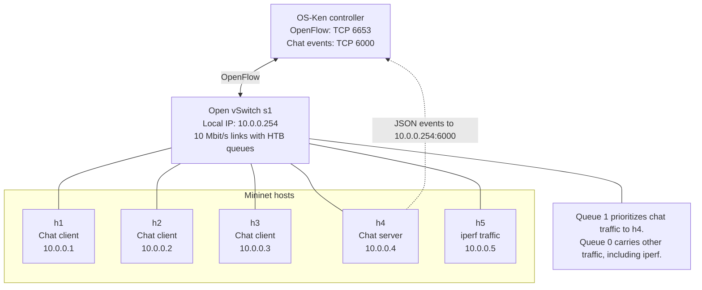

# Network diagram

```mermaid
flowchart TB
    controller["OS-Ken controller<br/>OpenFlow: TCP 6653<br/>Chat events: TCP 6000"]
    switch["Open vSwitch s1<br/>Local IP: 10.0.0.254<br/>10 Mbit/s links with HTB queues"]

    controller <-->|"OpenFlow"| switch

    subgraph hosts["Mininet hosts"]
        h1["h1<br/>Chat client<br/>10.0.0.1"]
        h2["h2<br/>Chat client<br/>10.0.0.2"]
        h3["h3<br/>Chat client<br/>10.0.0.3"]
        h4["h4<br/>Chat server<br/>10.0.0.4"]
        h5["h5<br/>iperf traffic<br/>10.0.0.5"]
    end

    switch --- h1
    switch --- h2
    switch --- h3
    switch --- h4
    switch --- h5

    h4 -. "JSON events to 10.0.0.254:6000" .-> controller

    note["Queue 1 prioritizes chat traffic to h4.<br/>Queue 0 carries other traffic, including iperf."]
    switch --- note
```
